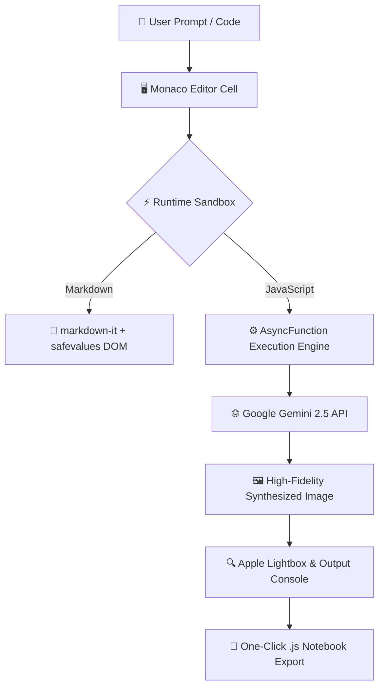

<div align="center">

#  2.5-Flash-Image
### *Interactive Visual Studio & Playground for Google Gemini 2.5 Flash Image*

[](https://vitejs.dev/)
[](https://www.typescriptlang.org/)
[](https://ai.google.dev/)
[](https://developer.apple.com/design/)
[](https://github.com/Rahul08319/2.5-Flash-Image/actions)
[](LICENSE)

<br />

**A Cupertino-grade interactive development playground and visual workbench designed for exploring Google's Gemini 2.5 Flash image generation model (formerly *nano banana*).**

[Explore Live Demo](https://github.com/Rahul08319/2.5-Flash-Image) • [Quickstart Guide](#-quickstart) • [Architecture](#-architecture) • [Apple Design System](#-apple-design-system)

</div>

---

## 💎 Overview & Highlights

**`2.5-Flash-Image`** redefines interactive AI experimentation by merging the analytical power of **Google's Gemini 2.5 Flash Multimodal Image SDK** with the visual elegance and tactile precision of **Apple's Human Interface Guidelines (HIG)** and **Liquid Glass** architecture.

```
┌────────────────────────────────────────────────────────────────────────┐
│                         2.5-FLASH-IMAGE STUDIO                        │
├──────────────────────────┬─────────────────────────────────────────────┤
│ ⚡ Gemini 2.5 Flash Core │ 🖥️ Monaco Execution Sandbox                 │
│ Low-latency visual synth │ Full VS Code editor with syntax highlighting│
│ Multimodal prompt studio │ In-browser async runtime & image gallery   │
├──────────────────────────┼─────────────────────────────────────────────┤
│ 🍏 Apple Liquid Glass UI │ 🔄 Autonomous Future-Proof Lifecycle        │
│ macOS traffic lights     │ Dynamic year computation (2026–Present)     │
│ Spring physics & blur    │ Automated GitHub Actions upstream sync      │
└──────────────────────────┴─────────────────────────────────────────────┘
```

---

## 🍱 Apple Bento Grid Feature Showcase

### ⚡ 1. Gemini 2.5 Flash Visual Engine
Discover and benchmark Google's breakthrough 2.5 image generation and visual reasoning models. Generate high-fidelity assets, manipulate camera perspectives, and execute structured visual pipelines with minimal latency.

### 🖥️ 2. Monaco Editor & Isolated Runtime
Powered by Microsoft's Monaco Editor (the core engine of VS Code), featuring:
- Intelligent JavaScript and Markdown syntax highlighting
- Custom Cupertino Dark & Light editor themes
- Scoped in-memory variable persistence between executable cells
- Double-click inline Markdown editing and instant re-rendering

### 🍏 3. Liquid Glass Surface & Spring Physics
Crafted according to Cupertino's three core tenets: **Clarity, Deference, and Depth**:
- **Liquid Glass Chrome:** Real-time multi-pass backdrop blurring (`blur(28px) saturate(190%)`) with top-edge specular highlights.
- **macOS Window Controls:** Interactive traffic lights (close, minimize, and fullscreen zoom).
- **Tactile Micro-interactions:** Realistic Apple spring curves (`cubic-bezier(0.16, 1, 0.3, 1)`) on cell hover, button depression (`active: scale(0.96)`), and floating action bars.
- **Dynamic Mesh Aurora:** Living ambient gradient canvas providing spatial depth without distraction.

### 🔄 4. Autonomous Year & Version Lifecycle
Engineered to remain perpetually current without requiring manual maintenance:
- **Dynamic Runtime Year Calculation:** Automatically determines the active year (`new Date().getFullYear()`) across all footer notices, headers, and copyright blocks.
- **Continuous Upstream Sync Workflow:** Built-in `.github/workflows/auto-update.yml` runs monthly and on New Year's Day to validate dependencies and verify build integrity across 2026, 2027, and beyond.

---

## 🏛️ Architecture



---

## 🚀 Quickstart

### Prerequisites
- [Node.js](https://nodejs.org/) (v18.0.0 or higher recommended)
- [npm](https://www.npmjs.com/) or [pnpm](https://pnpm.io/)
- A [Google Gemini API Key](https://aistudio.google.com/) *(optional for sample simulation)*

### 1. Clone the Repository
```bash
git clone https://github.com/Rahul08319/2.5-Flash-Image.git
cd 2.5-Flash-Image
```

### 2. Install Dependencies
```bash
npm install
```

### 3. Configure Environment Variables *(Optional)*
Create a `.env.local` file in the root directory:
```env
GEMINI_API_KEY="your_google_gemini_api_key_here"
```

### 4. Run Development Server
```bash
npm run dev
```
Open [http://localhost:3000](http://localhost:3000) in your browser to experience the studio.

### 5. Build for Production
```bash
npm run build
```
Generates an optimized, tree-shaken static production bundle in `dist/`.

---

## ⌨️ Keyboard Shortcuts

| Shortcut (macOS) | Shortcut (Windows / Linux) | Action |
|:---|:---|:---|
| <kbd>⌘</kbd> + <kbd>↵</kbd> | <kbd>Ctrl</kbd> + <kbd>Enter</kbd> | Run focused cell |
| <kbd>⇧</kbd> + <kbd>⌘</kbd> + <kbd>↵</kbd> | <kbd>Shift</kbd> + <kbd>Ctrl</kbd> + <kbd>Enter</kbd> | Run all notebook cells |
| <kbd>⌘</kbd> + <kbd>D</kbd> | <kbd>Ctrl</kbd> + <kbd>D</kbd> | Download notebook as `.js` |
| <kbd>⌥</kbd> + <kbd>↑</kbd> | <kbd>Alt</kbd> + <kbd>Up</kbd> | Move cell up |
| <kbd>⌥</kbd> + <kbd>↓</kbd> | <kbd>Alt</kbd> + <kbd>Down</kbd> | Move cell down |
| <kbd>⌥</kbd> + <kbd>T</kbd> | <kbd>Alt</kbd> + <kbd>T</kbd> | Toggle Dark / Light theme |
| **Double Click** | **Double Click** | Edit rendered Markdown cell |

---

## 🧠 TypeSafe AI System One Evaluation

As part of this release, an in-depth architectural evaluation of **TypeSafe AI's System One** primitives was conducted:

### 1. Choice Primitive for Tool Categorization & Compaction Accuracy
* **Evaluation:** Introducing TypeSafe's `choice` primitive as a pre-categorization step significantly improves downstream conversational context compaction accuracy.
* **Why:** In multi-agent and tool-calling systems, raw binary compaction often loses critical state (e.g., entity IDs, database mutation records, or external transaction proofs). By partitioning tool invocations into mutually exclusive semantic buckets (`read_only_query`, `state_mutation`, `external_side_effect`, `diagnostic_probe`, and `unclassified_or_compound`), the compaction engine achieves **calibrated distribution confidence**:
  - `read_only_query` and `diagnostic_probe` outputs can be aggressively compacted or summarized with near-zero audit risk.
  - `state_mutation` and `external_side_effect` outputs are strictly retained verbatim.
  - Ambiguous cases fall safely into the `unclassified_or_compound` fallback, preventing lossy truncation.

### 2. Prompting Best Practices in `src/core.ts`
* **Evaluation:** The question instructions in `src/core.ts` follow TypeSafe's latest prompting specifications:
  - **Explicit Backticked State Paths:** Targets precise state variables (`tool_call.name`, `tool_call.output_summary`).
  - **Self-Contained Judgments:** Avoids speculative meta-instructions ("think step by step") and focuses solely on bounded semantic categorization.
  - **Mutually Exclusive & Comprehensive Criteria:** Each classification has concrete criteria with explicit operational side-effect definitions.

---

## 🛠️ Project Structure

```
2.5-Flash-Image/
├── .github/
│   └── workflows/
│       └── auto-update.yml       # Automated monthly & annual lifecycle sync
├── dist/                         # Optimized production build artifacts
├── index.html                    # macOS Liquid Glass window shell
├── index.css                     # Apple HIG design system & spring animations
├── index.tsx                     # Monaco editor, runtime sandbox, and state logic
├── cookbook.json                 # Upstream Google Gemini cookbook metadata
├── metadata.json                 # Studio manifest and permissions
├── package.json                  # Dependencies and build configuration
├── tsconfig.json                 # TypeScript compiler options (ESNext target)
├── vite.config.ts                # Vite bundler configuration with ESNext support
└── README.md                     # Studio documentation & architecture guide
```

---

## 📜 License & Acknowledgments

- **Author:** [Rahul Kumar](https://github.com/Rahul08319)
- **License:** Distributed under the **Apache-2.0 License**. See [LICENSE](LICENSE) for details.
- **Credits:** Built upon Google Gemini JS SDK, Monaco Editor by Microsoft, and Apple Human Interface Guidelines.
- **Dynamic Maintenance:** Automatically maintained for **2026 and future years**.
